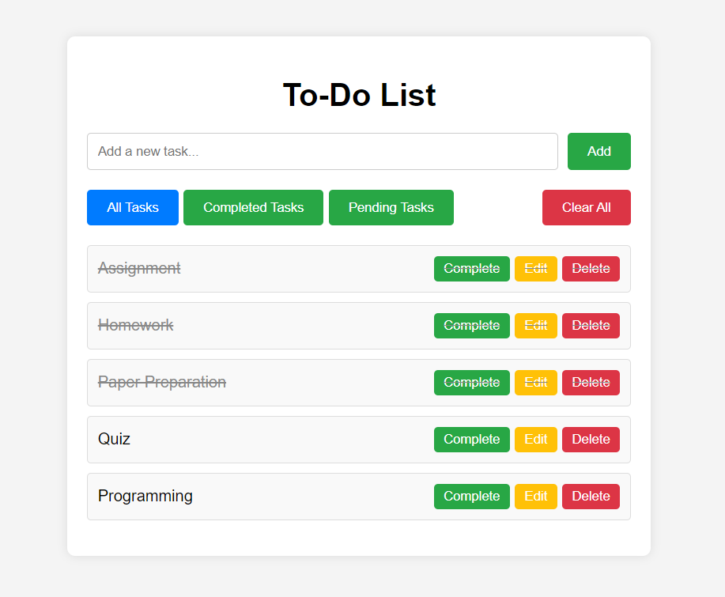

# To-Do List App

This is a simple To-Do List web application built using HTML, CSS, and JavaScript.

## Features

- Add new tasks
- Mark tasks as completed
- Edit existing tasks
- Delete tasks
- Filter tasks based on status (All Tasks, Completed Tasks, Pending Tasks)
- Clear all tasks

## Screenshots

